# analytical-figures

Ask [Claude Code](https://claude.com/claude-code) for a calibration curve from your `.spc` files
and get a journal-ready figure with LOD/LOQ, confidence and prediction bands and a residual panel,
plus one self-contained Python script that reproduces it. Ask for a calculated PXRD pattern from
a CIF, a cocrystal-vs-physical-mixture call or PLS diagnostics with leakage-safe cross-validation
and get the same: a figure that passed its checks, and the code that made it.

`analytical-figures` is a Claude Code skill for analytical chemistry and spectroscopy: FTIR/ATR
and PXRD spectra, calibration with figures of merit (LOD/LOQ, recovery, ICH Q2), multivariate
calibration (PLS/PCR/PCA), crystal structures from CIFs (validation table, calculated PXRD,
deterministic 3D views) and cocrystal identification.

It is not a plotting tutorial. It does two things a plotting library does not:

- **It gates the numbers before they reach a figure.** Ingest checks, identical processing across
  a batch, named error statistics (SD vs SEM vs CI, with n), leakage-safe cross-validation,
  mandatory residual panels, no extrapolation past the calibrated range, and a static critic
  that flags a figure-of-merit hand-typed onto a figure instead of interpolated from the code.
- **It hands over a script, not a PNG.** The deliverable is one self-contained Python file
  (`bundle.py` amalgamates the modules an analysis uses) with a provenance header, so every
  figure is reproducible, editable and attachable to a report.

<!-- gallery:start -->
<table>
<tr><td align="center"><a href="docs/gallery/full/composite_method.png">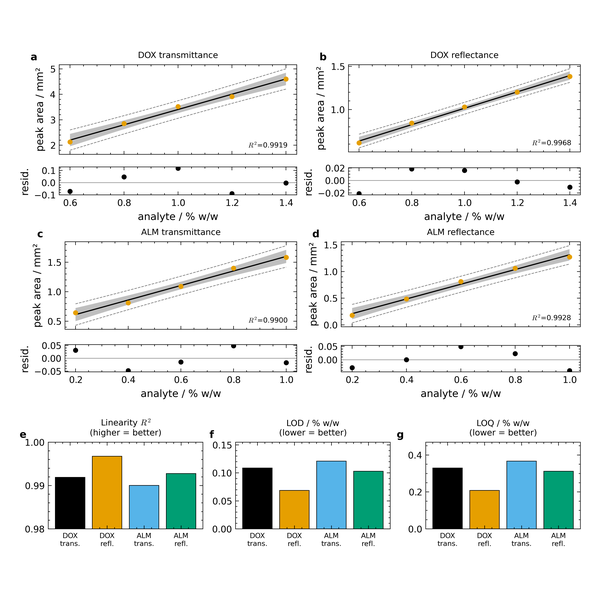</a></td><td align="center"><a href="docs/gallery/full/composite_specificity.png">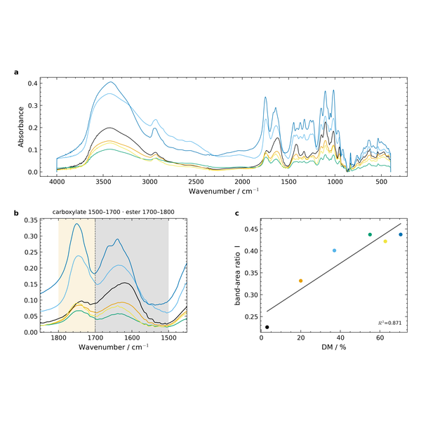</a></td><td align="center"><a href="docs/gallery/full/composite_pxrd.png">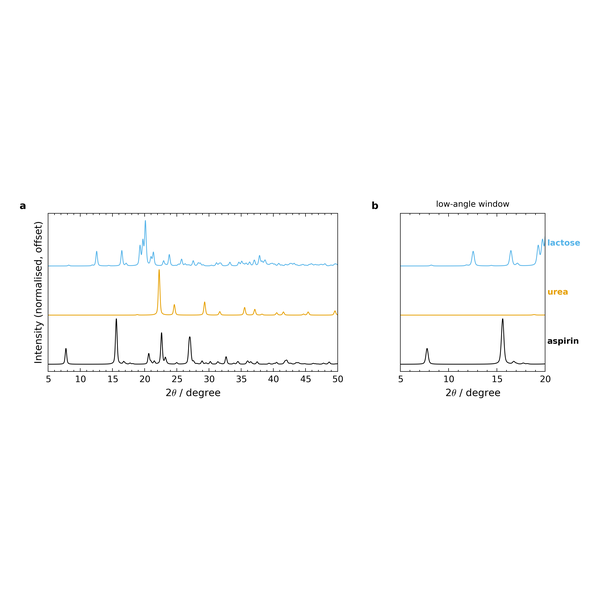</a></td><td align="center"><a href="docs/gallery/full/pls_diag.png">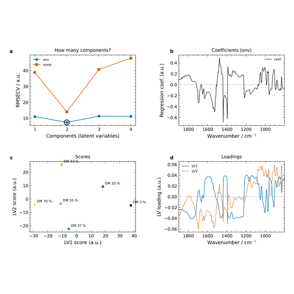</a></td><td align="center"><a href="docs/gallery/full/calib_pectin.png">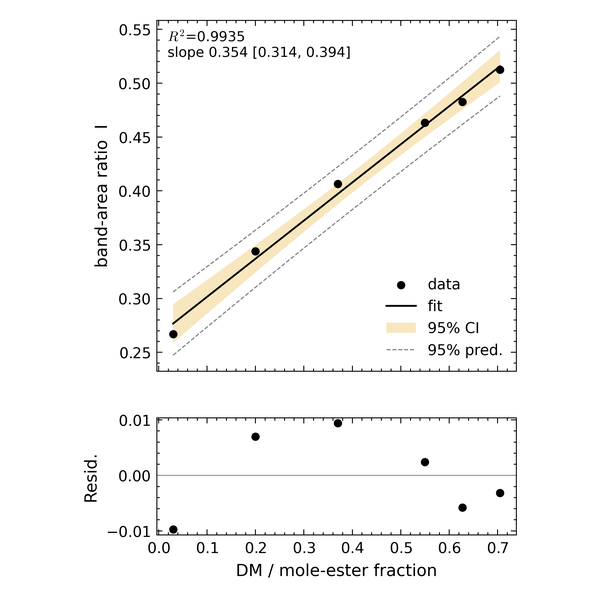</a></td><td align="center"><a href="docs/gallery/full/waterfall.png">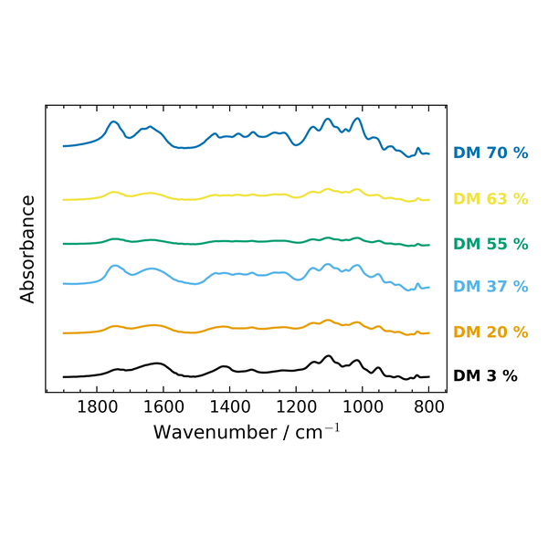</a></td></tr>
<tr><td align="center"><a href="docs/gallery/full/ddsimca.png">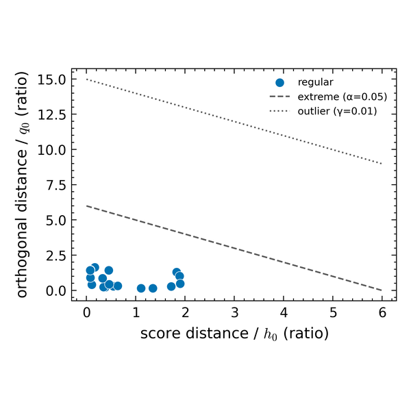</a></td><td align="center"><a href="docs/gallery/full/integration.png">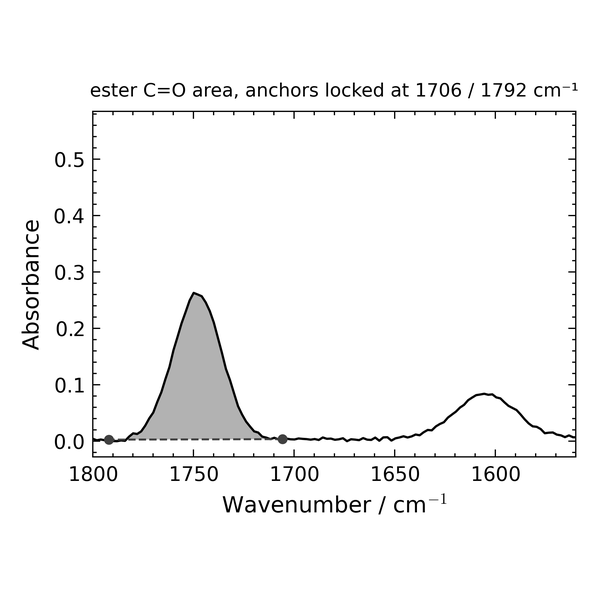</a></td><td align="center"><a href="docs/gallery/full/ortep.png">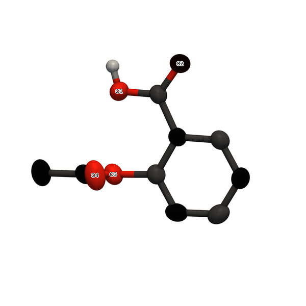</a></td><td align="center"><a href="docs/gallery/full/calib_bmc.png">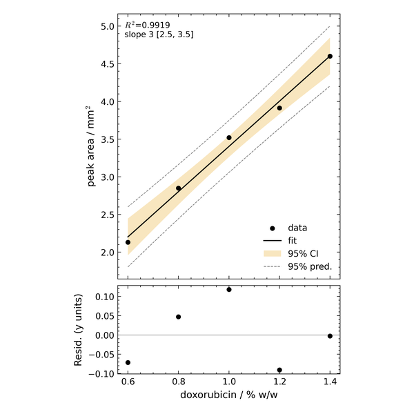</a></td><td align="center"><a href="docs/gallery/full/groundtruth.png">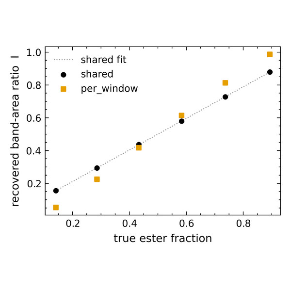</a></td><td align="center"><a href="docs/gallery/full/pxrd_calc.png">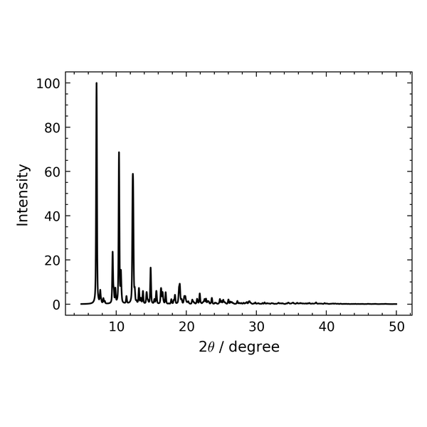</a></td></tr>
<tr><td align="center"><a href="docs/gallery/full/pxrd_realism.png">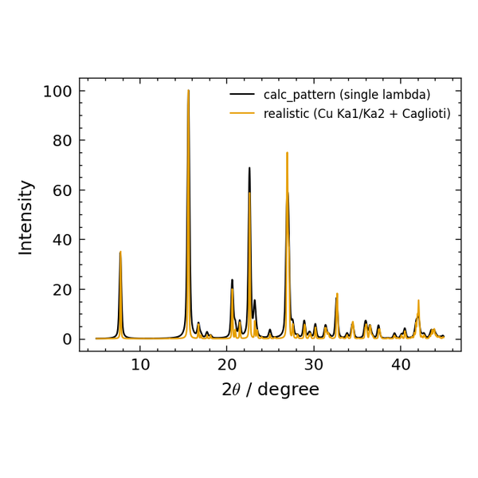</a></td><td align="center"><a href="docs/gallery/full/packing.png">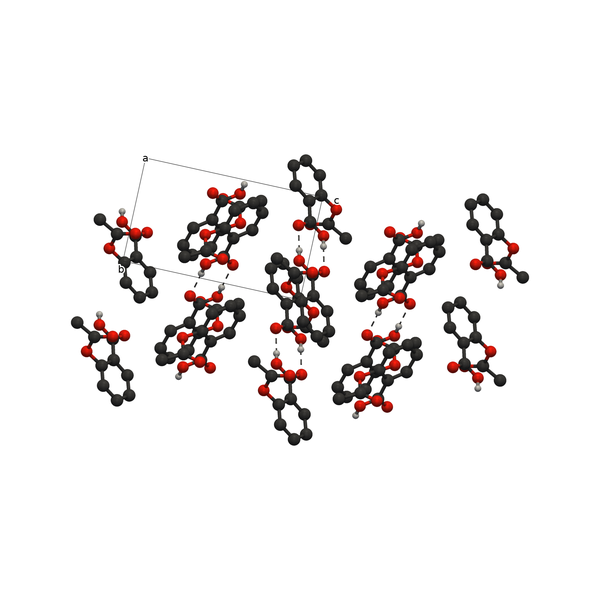</a></td><td align="center"><a href="docs/gallery/full/hbond_env.png">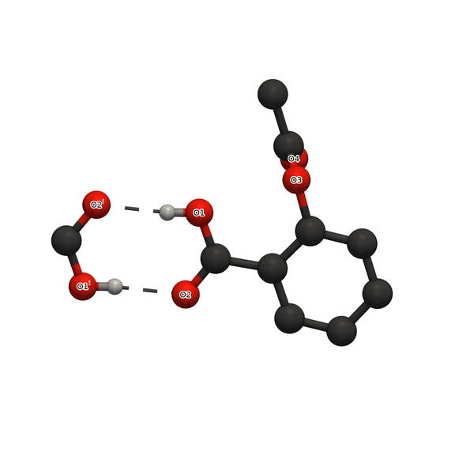</a></td><td align="center"><a href="docs/gallery/full/unit_cell.png">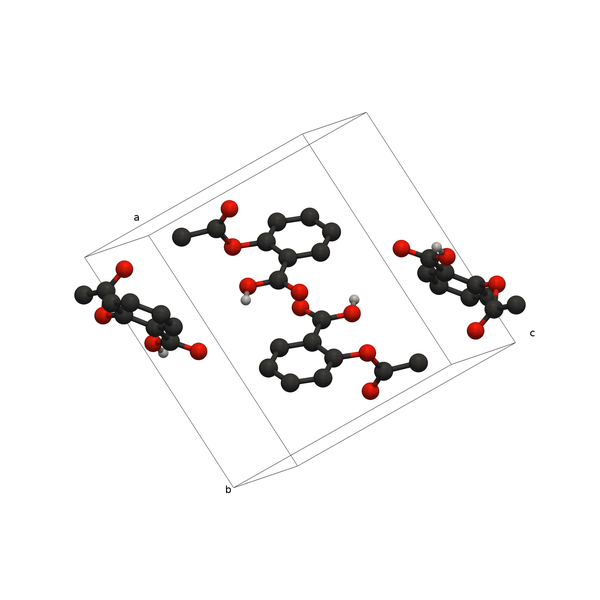</a></td><td align="center"><a href="docs/gallery/full/flufenamic.png">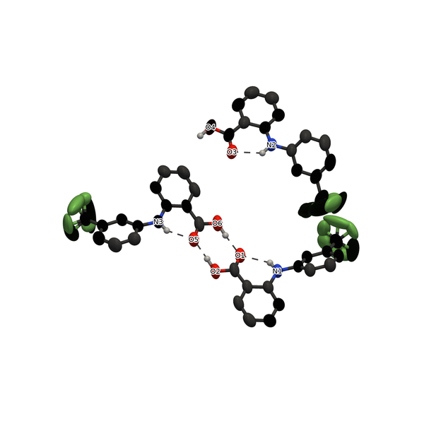</a></td><td align="center"><a href="docs/gallery/full/pyvista.png">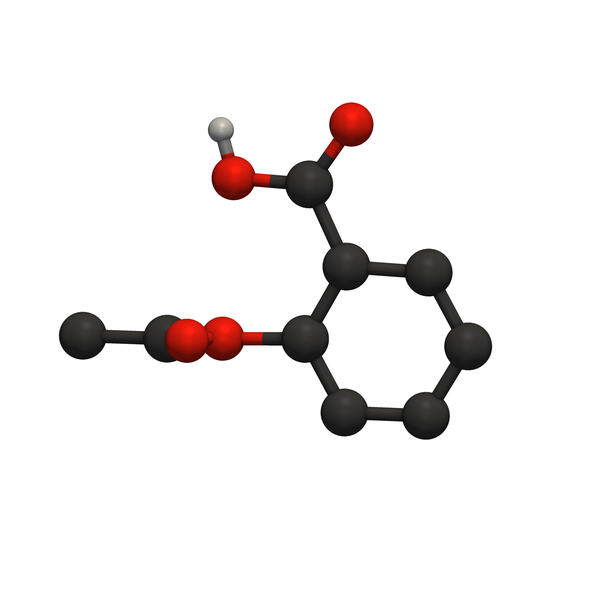</a></td></tr>
</table>

<sub>Hover a tile for what it is and where the data came from; click for full size. Every tile is produced by <code>docs/build_gallery.py</code> from public data and public CIFs — nothing is drawn by hand and nothing is synthetic. Interactive version with placards: <a href="https://thedop.github.io/analytical-figures-skill/">https://thedop.github.io/analytical-figures-skill/</a></sub>
<!-- gallery:end -->

<!-- examples:start -->
## From a prompt to a figure

Three prompts, run in this repository with the skill loaded. Left: the prompt and the gates that fired on the way. Right: what came back. Every run hands over one self-contained script that regenerates its figure, and the caption is interpolated from the computed values, never typed.

<table>
<tr>
<td width="46%" valign="top">
<p><b>“Doxorubicin peak areas from Bansal 2021, transmittance mode, 0.6–1.4 % w/w. Fit the calibration, give me LOD and LOQ, and read off the concentration for peak areas of 3.5 and 6.0 mm².”</b></p>
<p><sub>WHAT THE SKILL DID</sub><br>
· fit, 95 % bands and the mandatory residual panel from the published table<br>
· <code>LOD 0.109 % w/w, LOQ 0.330 % w/w  (residual_sd (3.3σ/m, 10σ/m))</code><br>
· read-back of 6.0 mm²: <code>REFUSED: predicted x=1.865 is outside the calibrated range [0.6, 1.4] - extrapolation refused (extend the calibration instead)</code></p>
<p><sub>WHAT YOU GET</sub><br>
<a href="docs/examples/bmc_lod/bmc_lod_standalone.py">one self-contained script</a> · <a href="docs/examples/bmc_lod/figure.png">the figure</a> · <a href="docs/examples/bmc_lod/caption.txt">its caption</a></p>
<details><summary>full log</summary>
<pre>$ python analysis.py
  [INFO] calibration: 5 pts, monotonic, finite - OK
  y = 3.002 x +0.402   R2 0.9919   n=5
  LOD 0.109 % w/w, LOQ 0.330 % w/w  (residual_sd (3.3σ/m, 10σ/m))
  intercept 0.4017 [-0.1161, 0.9195] (95% CI), t=2.47, p=0.090 -&gt; no significant constant bias (CI includes 0)
  peak area 3.50 mm2 -&gt; 1.032 % w/w
  peak area 6.00 mm2 -&gt; REFUSED: predicted x=1.865 is outside the calibrated range [0.6, 1.4] - extrapolation refused (extend the calibration instead)
  [INFO] layout: layout audit clean (data present, no tofu, ticks clear, panels labelled)
  wrote C:\Users\uriba\projects\IR_CoCr_Project\.claude\skills\analytical-figures\docs\examples\bmc_lod\out\bmc_dox_calibration.pdf + .png, caption.txt
[exit 0]
$ python bundle.py analysis.py -o bmc_lod_standalone.py
critic pass (number provenance):
  [INFO] critic: no hard-typed figures-of-merit - on-figure numbers trace to the code
wrote bmc_lod_standalone.py
[exit 0]
$ python bmc_lod_standalone.py      # the handed-over script, re-run on its own
 0.109 % w/w, LOQ 0.330 % w/w  (residual_sd (3.3σ/m, 10σ/m))
  intercept 0.4017 [-0.1161, 0.9195] (95% CI), t=2.47, p=0.090 -&gt; no significant constant bias (CI includes 0)
  peak area 3.50 mm2 -&gt; 1.032 % w/w
  peak area 6.00 mm2 -&gt; REFUSED: predicted x=1.865 is outside the calibrated range [0.6, 1.4] - extrapolation refused (extend the calibration instead)
  [INFO] layout: layout audit clean (data present, no tofu, ticks clear, panels labelled)
  wrote C:\Users\uriba\projects\IR_CoCr_Project\.claude\skills\analytical-figures\docs\examples\bmc_lod\out\bmc_dox_calibration.pdf + .png, caption.txt
[exit 0]</pre></details>
</td>
<td width="54%" valign="top"><a href="docs/examples/bmc_lod/figure.png">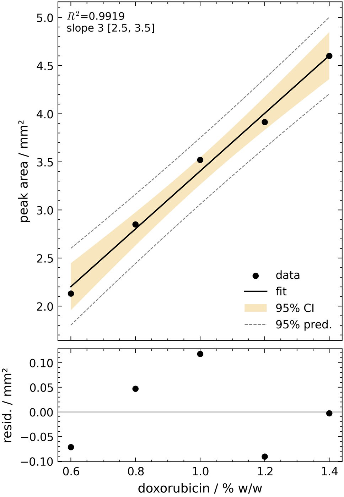</a></td>
</tr>
<tr>
<td width="46%" valign="top">
<p><b>“Here is aspirin&#x27;s CIF (COD 7247819). Validate it, calculate its Cu Kα powder pattern, and give me an ORTEP view with the hydrogen bonds.”</b></p>
<p><sub>WHAT THE SKILL DID</sub><br>
· validated before drawing anything: <code>density (i)=1.3999 (ii)=1.3997 (iii)=1.4 -&gt; PASS (all consistent)</code><br>
· Cu Kα pattern from a Mo-refined CIF, independently cross-checked: <code>cross-check [pymatgen]: top peak 15.607 vs 15.619, delta 0.012 deg (gate &lt;0.05)</code><br>
· ORTEP at 50 % probability, C–H hidden, heteroatoms labelled, the hydrogen bond drawn</p>
<p><sub>WHAT YOU GET</sub><br>
<a href="docs/examples/cif_report/cif_report_standalone.py">one self-contained script</a> · <a href="docs/examples/cif_report/figure_1.png">the figure</a> · <a href="docs/examples/cif_report/caption.txt">its caption</a></p>
<details><summary>full log</summary>
<pre>$ python analysis.py
  [INFO] density: density (i)=1.3999 (ii)=1.3997 (iii)=1.4 -&gt; PASS (all consistent)
  [INFO] geometry: Block B: 21 unique bonds, 0 outside the covalent envelope (±0.25 A; coarse bound, not Mogul)
  [INFO] hbonds: 1 H-bonds + 0 geometric contacts (donors=[&#x27;N&#x27;, &#x27;O&#x27;], acceptors=[&#x27;Cl&#x27;, &#x27;F&#x27;, &#x27;N&#x27;, &#x27;O&#x27;, &#x27;S&#x27;], floor=120 deg)
  [INFO] wavelength: wavelength 0.71073 A matches Mo
  [INFO] spacegroup: space group P 1 21/c 1: 4 symops, consistent
VALIDATION TABLE — 7247819  (P 1 21/c 1, 4 ops)
----------------------------------------------------------------
Block A — crystal data
  cell volume   calc 854.83   decl 854.8
  density (i)   1.3999  (expanded-cell, assumption-free, CODATA)
  density (ii)  1.3997  (checkCIF formula, 1.66042)
  density (iii) 1.4  (declared)
  RD            1.0002  (ok)
     -&gt; PASS (all consistent)
  F(000)        calc 376   decl 376.0
  formula wt    from formula_sum 180.15742   decl 180.15
  elements      [&#x27;C&#x27;, &#x27;H&#x27;, &#x27;O&#x27;]
  wavelength    0.71073  (MoK\a)  [wavelength 0.71073 A matches Mo]
  space group   space group P 1 21/c 1: 4 symops, consistent
  special pos   none
  echo (not recomputed)  T=296(2)  R(gt)=0.0524  GoF=1.037  reflns=1946.0  th_max=27.442  size=0.463x0.186x0.03
Block B — geometry (bond lengths vs covalent-radii sum +/-0.25 A; coarse bound, not Mogul)
  0 outlier(s) of 21 unique bonds
Block C — H-bonds (D-H...A, X-H normalized; D...A class by Jeffrey; sym = operator on A)
  D      H      A         D-H   H..A   D..A    ang  class     sym
  O1     H1     O2      0.820  1.673  2.652  173.2  moderate  3_656
  [INFO] pxrd: PXRD: lambda=1.54060 A (cfg); 31 peaks &gt;2%; strongest 2theta=15.607
  [INFO] pxrd: cross-check [pymatgen]: top peak 15.607 vs 15.619, delta 0.012 deg (gate &lt;0.05)
  [INFO] layout: layout audit clean (data present, no tofu, ticks clear, panels labelled)
  [INFO] pxrd: PXRD: lambda=1.54060 A (cfg); 31 peaks &gt;2%; strongest 2theta=15.607
  [INFO] pxrd: cross-check [pymatgen]: top peak 15.607 vs 15.619, delta 0.012 deg (gate &lt;0.05)
  strongest reflection: {&#x27;two_theta&#x27;: 15.607, &#x27;d&#x27;: 5.6733, &#x27;hkl&#x27;: &#x27;0 0 -2&#x27;, &#x27;I&#x27;: 100.0}
  [INFO] hbond_env: symmetry key for the caption: (i) -x+1, -y, -z+1
  wrote pxrd.pdf/.png, structure_ellipsoid.png, hbonds.csv, peaks.csv, caption.txt
[exit 0]
$ python bundle.py analysis.py -o cif_report_standalone.py
critic pass (number provenance):
  [INFO] critic: no hard-typed figures-of-merit - on-figure numbers trace to the code
wrote cif_report_standalone.py
[exit 0]
$ python cif_report_standalone.py      # the handed-over script, re-run on its own
anels labelled)
  [INFO] pxrd: PXRD: lambda=1.54060 A (cfg); 31 peaks &gt;2%; strongest 2theta=15.607
  [INFO] pxrd: cross-check [pymatgen]: top peak 15.607 vs 15.619, delta 0.012 deg (gate &lt;0.05)
  strongest reflection: {&#x27;two_theta&#x27;: 15.607, &#x27;d&#x27;: 5.6733, &#x27;hkl&#x27;: &#x27;0 0 -2&#x27;, &#x27;I&#x27;: 100.0}
  [INFO] hbond_env: symmetry key for the caption: (i) -x+1, -y, -z+1
  wrote pxrd.pdf/.png, structure_ellipsoid.png, hbonds.csv, peaks.csv, caption.txt
[exit 0]</pre></details>
</td>
<td width="54%" valign="top"><a href="docs/examples/cif_report/figure_1.png">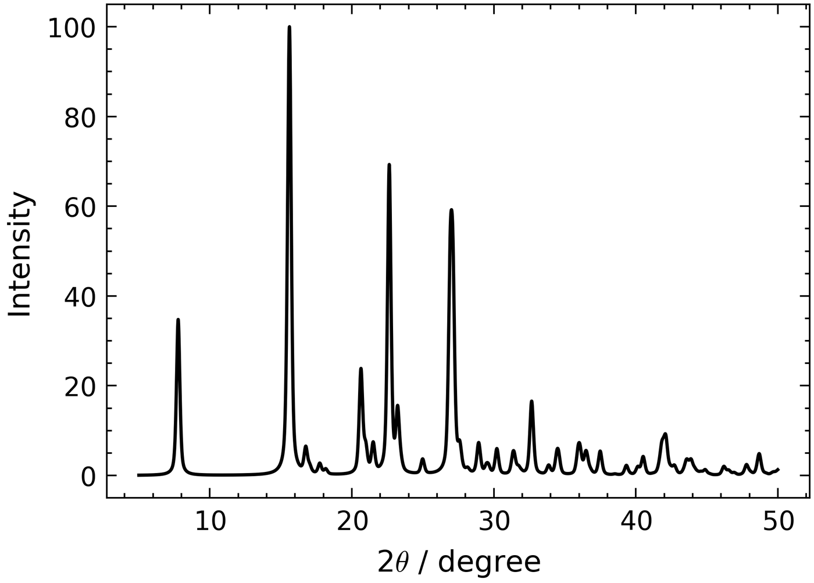</a><a href="docs/examples/cif_report/figure_2.png">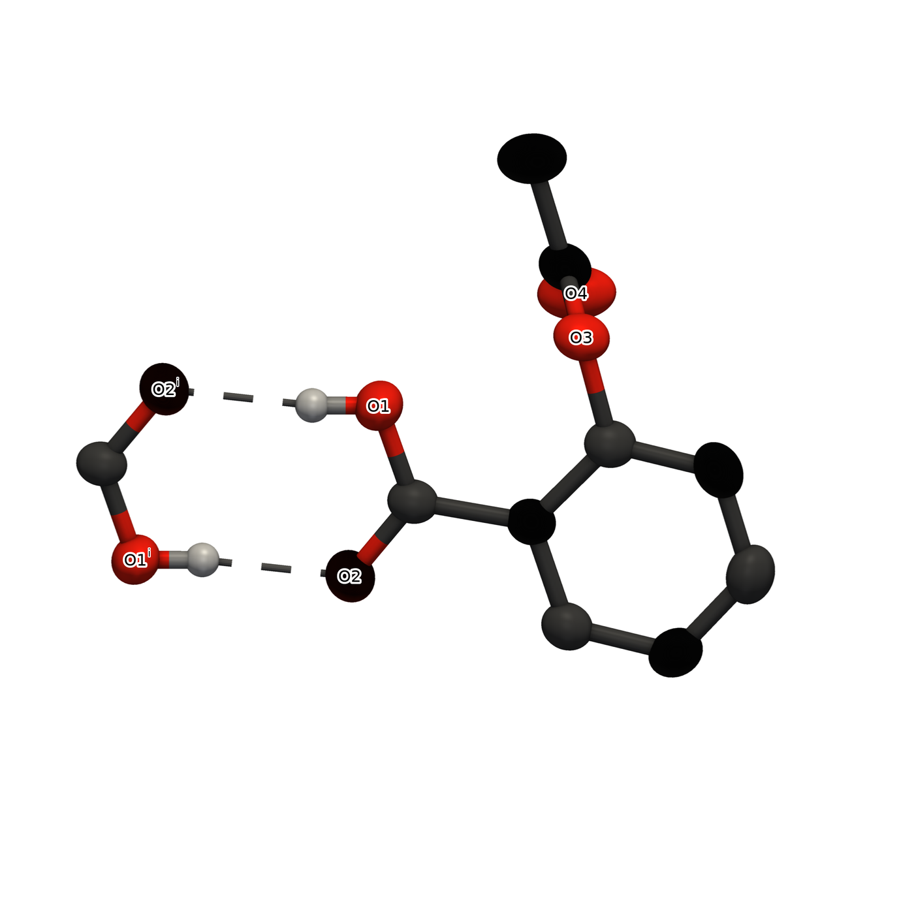</a></td>
</tr>
<tr>
<td width="46%" valign="top">
<p><b>“Six pectin calibration standards as CSV (DM 3–70 %). Give me a publication figure of the carbonyl region and the ester/(ester+carboxylate) band-area calibration, with the LOD.”</b></p>
<p><sub>WHAT THE SKILL DID</sub><br>
· every file gated on ingest: <code>DM3: 3736 pts, monotonic, finite - OK</code><br>
· one shared baseline for the two overlapping bands, split at 1700 cm⁻¹<br>
· and it says when a method is weak: <code>p=0.001 -&gt; constant bias: intercept significantly != 0 (CI excludes 0)</code></p>
<p><sub>WHAT YOU GET</sub><br>
<a href="docs/examples/pectin_calibration/pectin_calibration_standalone.py">one self-contained script</a> · <a href="docs/examples/pectin_calibration/figure.png">the figure</a> · <a href="docs/examples/pectin_calibration/caption.txt">its caption</a> · <a href="docs/examples/pectin_calibration/methods.txt">paste-ready methods text</a></p>
<details><summary>full log</summary>
<pre>$ python analysis.py
  [INFO] ingest: DM3.csv: 108345 B
  [INFO] DM3: 3736 pts, monotonic, finite - OK
  [INFO] ingest: DM20.csv: 108344 B
  [INFO] DM20: 3736 pts, monotonic, finite - OK
  [INFO] ingest: DM37.csv: 108344 B
  [INFO] DM37: 3736 pts, monotonic, finite - OK
  [INFO] ingest: DM55.csv: 108344 B
  [INFO] DM55: 3736 pts, monotonic, finite - OK
  [INFO] ingest: DM62.8.csv: 108344 B
  [INFO] DM62.8: 3736 pts, monotonic, finite - OK
  [INFO] ingest: DM70.5.csv: 108344 B
  [INFO] DM70.5: 3736 pts, monotonic, finite - OK
  [INFO] calibration: 6 pts, monotonic, finite - OK
  slope 0.00297 per % DM [0.00139, 0.00455]  R2 0.872  n=6
  LOD 37.1 % DM, LOQ 112.4 % DM  (residual_sd (3.3σ/m, 10σ/m))
  intercept 0.2539 [0.1783, 0.3294] (95% CI), t=9.32, p=0.001 -&gt; constant bias: intercept significantly != 0 (CI excludes 0)
  [INFO] layout: layout audit clean (data present, no tofu, ticks clear, panels labelled)
  wrote C:\Users\uriba\projects\IR_CoCr_Project\.claude\skills\analytical-figures\docs\examples\pectin_calibration\out\pectin_calibration.pdf + .png, caption.txt
[exit 0]
$ python bundle.py analysis.py -o pectin_calibration_standalone.py
critic pass (number provenance):
  [INFO] critic: no hard-typed figures-of-merit - on-figure numbers trace to the code
wrote pectin_calibration_standalone.py
[exit 0]
$ python pectin_calibration_standalone.py      # the handed-over script, re-run on its own
  [INFO] DM70.5: 3736 pts, monotonic, finite - OK
  [INFO] calibration: 6 pts, monotonic, finite - OK
  slope 0.00297 per % DM [0.00139, 0.00455]  R2 0.872  n=6
  LOD 37.1 % DM, LOQ 112.4 % DM  (residual_sd (3.3σ/m, 10σ/m))
  intercept 0.2539 [0.1783, 0.3294] (95% CI), t=9.32, p=0.001 -&gt; constant bias: intercept significantly != 0 (CI excludes 0)
  [INFO] layout: layout audit clean (data present, no tofu, ticks clear, panels labelled)
  wrote C:\Users\uriba\projects\IR_CoCr_Project\.claude\skills\analytical-figures\docs\examples\pectin_calibration\out\pectin_calibration.pdf + .png, caption.txt
[exit 0]</pre></details>
</td>
<td width="54%" valign="top"><a href="docs/examples/pectin_calibration/figure.png">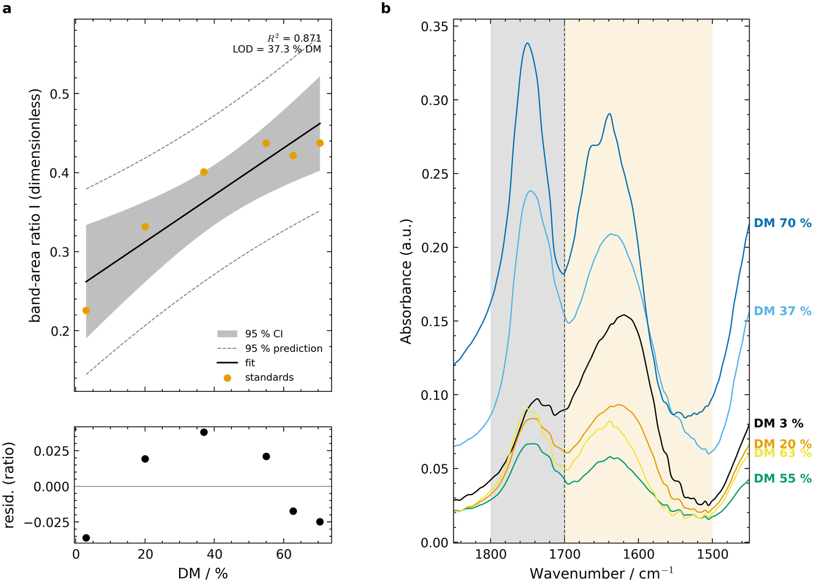</a></td>
</tr>
</table>
<!-- examples:end -->

## Install

As a plugin, from inside Claude Code (two commands; the repo is its own marketplace):

```
/plugin marketplace add TheDop/analytical-figures-skill
/plugin install analytical-figures@analytical-figures-marketplace
```

Or clone into a Claude Code skills directory, user-level or per project:

```
git clone https://github.com/TheDop/analytical-figures-skill ~/.claude/skills/analytical-figures        # available in every project
git clone https://github.com/TheDop/analytical-figures-skill .claude/skills/analytical-figures           # this project only
```

Either way, install the Python side once:

```
python -m pip install -r requirements.txt        # from the cloned/installed skill directory
```

`numpy` and `matplotlib` are required; `scipy` is strongly recommended. Everything else is
per-family and imported lazily, so an FTIR job never pulls it: `requirements.txt` adds
`scikit-learn` (chemometrics) and `rdkit` (the cocrystal predictor); the crystal family needs
`python -m pip install gemmi Dans-Diffraction` (plus `pymatgen` for the PXRD cross-check and
`pyvista` for the VTK renders), which the skill asks for by name the first time a CIF job runs.
Claude Code loads the skill at session start. Then ask for what you need: a replicate overlay
with %RSD, a calibration curve with LOD/LOQ, a calculated PXRD pattern from a CIF, a
cocrystal-vs-mixture call.

## What is inside

| Path | Role |
|---|---|
| `SKILL.md` | The operating instructions Claude reads: workflow, hard principles, the single-CONFIG rule. |
| `scripts/` | The maintained modules: `config`, `style`, `verify`, `spectra`, `calibration`, `chemometrics`, `charts`, `doe`, `report`, `crystal_engine`, `crystal_pxrd`, `crystal_view`, `pxrd_realism`, `cocrystal`, `sources`. |
| `references/` | Decision docs: `figure_selection.md` (what to plot, and why), `cocrystal_id.md` (which evidence identifies a cocrystal), `databases.md` (where to source each external fact), plus per-family conventions. |
| `templates/analysis_template.py` | Copy this to start an analysis; `bundle.py` turns it into a standalone deliverable. |
| `cli.py` | QC shortcuts: `.spc` replicates to band area/%RSD, a conc/signal CSV to slope, R², LOD/LOQ. |
| `assets/styles/` | Journal `.mplstyle` presets (Nature, ACS, IEEE, general). |
| `tests/`, `skill_validation/` | The test gate and the numeric-parity suites, below. |
| `ROADMAP.md`, `VISION.md` | Backlog and build log; longer-range ideas. |

The modules are plain Python, so the skill also works without Claude: run from the skill root
and `from scripts import spectra, calibration` as the template does.

## Validation

`python -m pytest tests/` is one green gate for the whole skill (81 tests). It checks module
imports, the `SKILL.md` structure, the `bundle.py` round-trip, p-value correction against
`statsmodels`, the style presets and the CLI, and it bridges in three numeric-parity suites:

| Suite | Checks | Validated against |
|---|---|---|
| `skill_validation/chemometrics/` | 100 | closed-form fixtures, `scikit-learn`, published R `mdatools` critical limits, the biospectools EMSC gold |
| `skill_validation/cocrystal/` | 26 | closed-form Rwp, `scipy.optimize.nnls`, the Cruz-Cabeza ΔpKa zones |
| `skill_validation/pxrd/` | 23 | March–Dollase, Cu Kα₁/Kα₂ doublet, Caglioti, pseudo-Voigt |

| `skill_validation/ftir_integration/` | 14 | closed-form Gaussian areas and `scipy.integrate.quad` under sloping baselines, noise and band overlap; plus the integrator run against the published pectin-DM (Wang 2023) and BMC 2021 calibrations |
| `skill_validation/crystal/` | 9 CIFs | a CIF edge-case set (disorder groups, special positions, Z′ = 9, chiral, multi-block, synthetic broken inputs): the engine's table, an independent gemmi-only second opinion, ADP U_eq, the Dans reflection list vs `pymatgen`. Needs `gemmi` + `Dans_Diffraction`; pytest skips it otherwise |

The 24 pectin spectra (CC BY 4.0) are vendored. Data that cannot be redistributed is fetched on
demand instead: the biospectools EMSC gold and the R `pls` gasoline set
(`skill_validation/chemometrics/datasets/fetch.py`) and the CCDC CIFs. Every check that needs
one of them skips cleanly when it is absent.

## Known limitations

- The crystal family is written for small-molecule cells. Bond, geometry and H-bond searches use a
  KD-tree on a cached supercell, but the first calculated pattern per structure still parses the CIF
  and computes structure factors (seconds for a few hundred atoms); later calls reuse the cache.
- The realistic PXRD profile evaluates each reflection within ±40 FWHM of its centre (`window_fwhm`);
  the discarded Lorentzian tail is below counting quantisation on lab patterns, and `window_fwhm=None`
  restores the exact full-grid sum.
- `audit_layout` is a set of heuristics (tick overlap, clipping, letters, unit cues). It catches the
  common faults; reading the saved PNG is still part of the workflow, not a formality.

## Provenance and licence

Built during an MSc analytical-chemistry project: quantifying an API in a binary excipient
mixture by ATR-FTIR, then identifying cocrystals by FTIR and PXRD. The worked examples in the
docs (aspirin in lactose, theophylline cocrystals) come from that work.

MIT licence (see `LICENSE`). The figure-selection scaffolding and the panel-label alignment
trick are adapted from [scipilot-figure-skill](https://github.com/Haojae/scipilot-figure-skill)
(MIT, Haojae); details in `THIRD_PARTY_NOTICES.md`.
