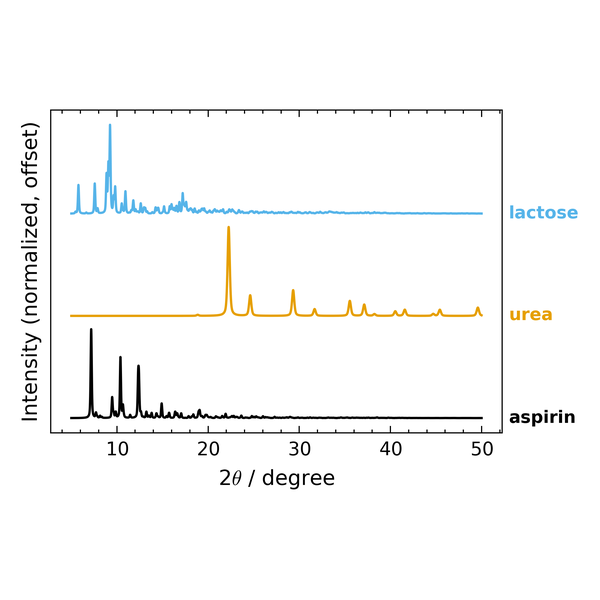
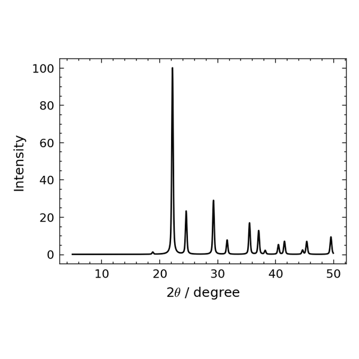

# analytical-figures

A [Claude Code](https://claude.com/claude-code) skill for **publication-grade figures and the
gated analysis behind them** in analytical chemistry and spectroscopy: FTIR/ATR and PXRD spectra,
calibration curves with figures of merit (LOD/LOQ, recovery, ICH Q2), multivariate calibration
(PLS/PCR/PCA), crystal structures from CIFs (validation table, calculated PXRD, deterministic 3D
views) and cocrystal identification.

It is not a plotting tutorial. It does two things a plotting library does not:

- **It gates the numbers before they reach a figure.** Ingest checks, identical processing across
  a batch, named error statistics (SD vs SEM vs CI, with n), leakage-safe cross-validation,
  mandatory residual panels, no extrapolation past the calibrated range, and a static critic
  that flags a figure-of-merit hand-typed onto a figure instead of interpolated from the code.
- **It hands over a script, not a PNG.** The deliverable is one self-contained Python file
  (`bundle.py` amalgamates the modules an analysis uses) with a provenance header, so every
  figure is reproducible, editable and attachable to a report.

<!-- gallery:start -->
<table>
<tr><td align="center"><a href="docs/gallery/full/calib_pectin.png"></a></td><td align="center"><a href="docs/gallery/full/waterfall.png"></a></td><td align="center"><a href="docs/gallery/full/pls_diag.png"></a></td><td align="center"><a href="docs/gallery/full/pxrd_overlay.png"></a></td><td align="center"><a href="docs/gallery/full/ortep.png"></a></td><td align="center"><a href="docs/gallery/full/ddsimca.png"></a></td></tr>
<tr><td align="center"><a href="docs/gallery/full/integration.png"></a></td><td align="center"><a href="docs/gallery/full/calib_bmc.png"></a></td><td align="center"><a href="docs/gallery/full/groundtruth.png"></a></td><td align="center"><a href="docs/gallery/full/pxrd_calc.png"></a></td><td align="center"><a href="docs/gallery/full/pxrd_realism.png"></a></td><td align="center"><a href="docs/gallery/full/packing.png"></a></td></tr>
<tr><td align="center"><a href="docs/gallery/full/hbond_env.png"></a></td><td align="center"><a href="docs/gallery/full/unit_cell.png"></a></td><td align="center"><a href="docs/gallery/full/flufenamic.png"></a></td><td align="center"><a href="docs/gallery/full/pxrd_urea.png"></a></td><td align="center"><a href="docs/gallery/full/ballstick.png"></a></td><td align="center"><a href="docs/gallery/full/pyvista.png"></a></td></tr>
</table>

<sub>Hover a tile for what it is and where the data came from; click for full size. Every tile is produced by <code>docs/build_gallery.py</code> from public data, public CIFs or the synthetic validation set — nothing is drawn by hand. Interactive version with placards: <a href="https://thedop.github.io/analytical-figures-skill/">https://thedop.github.io/analytical-figures-skill/</a></sub>
<!-- gallery:end -->

## Install

Clone into a Claude Code skills directory, user-level or per project:

```
git clone https://github.com/TheDop/analytical-figures-skill ~/.claude/skills/analytical-figures        # available in every project
git clone https://github.com/TheDop/analytical-figures-skill .claude/skills/analytical-figures           # this project only
python -m pip install -r ~/.claude/skills/analytical-figures/requirements.txt
```

`numpy` and `matplotlib` are required; `scipy` is strongly recommended. Everything else is
per-family and imported lazily (`scikit-learn` for chemometrics, `gemmi` + `Dans_Diffraction`
for crystal structures, `rdkit` for the cocrystal predictor), so an FTIR job never pulls them.
Claude Code loads the skill at session start. Then ask for what you need: a replicate overlay
with %RSD, a calibration curve with LOD/LOQ, a calculated PXRD pattern from a CIF, a
cocrystal-vs-mixture call.

## What is inside

| Path | Role |
|---|---|
| `SKILL.md` | The operating instructions Claude reads: workflow, hard principles, the single-CONFIG rule. |
| `scripts/` | The maintained modules: `config`, `style`, `verify`, `spectra`, `calibration`, `chemometrics`, `charts`, `doe`, `report`, `crystal_engine`, `crystal_pxrd`, `crystal_view`, `pxrd_realism`, `cocrystal`, `sources`. |
| `references/` | Decision docs: `figure_selection.md` (what to plot, and why), `cocrystal_id.md` (which evidence identifies a cocrystal), `databases.md` (where to source each external fact), plus per-family conventions. |
| `templates/analysis_template.py` | Copy this to start an analysis; `bundle.py` turns it into a standalone deliverable. |
| `cli.py` | QC shortcuts: `.spc` replicates to band area/%RSD, a conc/signal CSV to slope, R², LOD/LOQ. |
| `assets/styles/` | Journal `.mplstyle` presets (Nature, ACS, IEEE, general). |
| `tests/`, `skill_validation/` | The test gate and the numeric-parity suites, below. |
| `ROADMAP.md`, `VISION.md` | Backlog and build log; longer-range ideas. |

The modules are plain Python, so the skill also works without Claude: run from the skill root
and `from scripts import spectra, calibration` as the template does.

## Validation

`python -m pytest tests/` is one green gate for the whole skill (81 tests). It checks module
imports, the `SKILL.md` structure, the `bundle.py` round-trip, p-value correction against
`statsmodels`, the style presets and the CLI, and it bridges in three numeric-parity suites:

| Suite | Checks | Validated against |
|---|---|---|
| `skill_validation/chemometrics/` | 100 | closed-form fixtures, `scikit-learn`, published R `mdatools` critical limits, the biospectools EMSC gold |
| `skill_validation/cocrystal/` | 26 | closed-form Rwp, `scipy.optimize.nnls`, the Cruz-Cabeza ΔpKa zones |
| `skill_validation/pxrd/` | 23 | March–Dollase, Cu Kα₁/Kα₂ doublet, Caglioti, pseudo-Voigt |

| `skill_validation/ftir_integration/` | 14 | closed-form Gaussian areas and `scipy.integrate.quad` under sloping baselines, noise and band overlap; plus the integrator run against the published pectin-DM (Wang 2023) and BMC 2021 calibrations |
| `skill_validation/crystal/` | 9 CIFs | a CIF edge-case set (disorder groups, special positions, Z′ = 9, chiral, multi-block, synthetic broken inputs): the engine's table, an independent gemmi-only second opinion, ADP U_eq, the Dans reflection list vs `pymatgen`. Needs `gemmi` + `Dans_Diffraction`; pytest skips it otherwise |

External data is fetched on demand rather than vendored: the biospectools EMSC gold and the R
`pls` gasoline set (`skill_validation/chemometrics/datasets/fetch.py`), the Mendeley pectin
spectra, and the CCDC CIFs, which cannot be redistributed. Every check that needs one of them
skips cleanly when it is absent.

## Provenance and licence

Built during an MSc analytical-chemistry project: quantifying an API in a binary excipient
mixture by ATR-FTIR, then identifying cocrystals by FTIR and PXRD. The worked examples in the
docs (aspirin in lactose, theophylline cocrystals) come from that work.

MIT licence (see `LICENSE`). The figure-selection scaffolding and the panel-label alignment
trick are adapted from [scipilot-figure-skill](https://github.com/Haojae/scipilot-figure-skill)
(MIT, Haojae); details in `THIRD_PARTY_NOTICES.md`.
